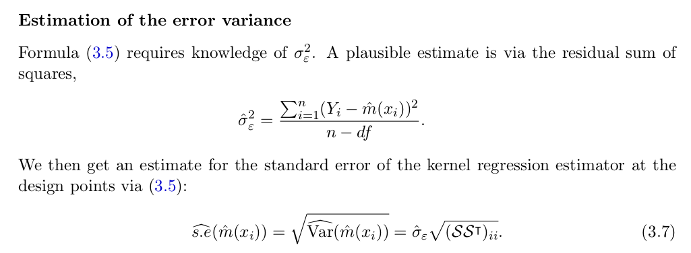

```{r setup, include=FALSE}
knitr::opts_chunk$set(echo = TRUE)
```

## a) simulate and draw bias and variance

First generate the design points and set up the true function m: 

```{r}
set.seed(79)
x <- seq(-1, 1, length=101) # design points
nrep <- 1000
m <- function(x) x+4*cos(7*x) # true function
```

Do the simulation, estimations are stored in matrices of 101*1000: 
```{r}
estnw <- estlp <- estss <- matrix(0,nrow = 101, ncol = nrep) # matrices storing the estimated function at design points m_hat(x)
for(i in 1:nrep){
  y <- m(x) + rnorm(101)
  estnw[,i] <- ksmooth(x, y, kernel = "normal", bandwidth = 0.2, x.points = x)$y
  estlp[,i] <- predict(loess(y~x, span = 0.2971339), newdata=x)
  estss[,i] <- predict(smooth.spline(x, y, spar = 0.623396), x=x)$y
}
```

calculate mean of estimations at design points `m_hat(x)`, and calculate the bias = `m_hat(x)-m(x)`, and calculate the variance of `m_hat(x)`: 
```{r}
means <- cbind(apply(estnw,1,mean), apply(estlp,1,mean), apply(estss,1,mean))
bias <- means - m(x)
variances <- cbind(apply(estnw,1,var), apply(estlp,1,var), apply(estss,1,var))
```

plot out: 
```{r}
par(mfrow=c(3,2))
# estimations
matplot(x, means, lty=2:4, col=2:4, type="l", xlab="x", ylab="m(x)")
lines(x, m(x)) # true points
rug(x)
legend(-0.7, 4.5, lty=1:4, col=1:4, c("true", "nw", "lp", "ss"), cex=0.6)
# bias
matplot(x, bias, lty=2:4, col=2:4, type="l", xlab="x", ylab="Bias(x)")
rug(x)
abline(h=0)
# bias^2
matplot(x, bias^2, lty=2:4, col=2:4, type="l", xlab="x", ylab="Bias^2(x)", ylim=c(0,0.4))
rug(x)
# variances
matplot(x, variances, lty=2:4, col=2:4, type="l", xlab="x", ylab="Variance(x)", ylim=c(0,0.4))
rug(x)
# MSE = bias^2 + var
matplot(x, variances+bias^2, lty=2:4, col=2:4, type="l", xlab="x", ylab="MSE(x)", ylim=c(0,0.4))
rug(x)
```

Remark:

>Looking at the pictures, we see the bias are high in regions where the true funciton have curvature, bias is propotional to the curvature m''(x). LP and SS tend to have lower bias than NW, LP has higher variances, but have the smallest MSE. 

>Both var and bias are high at the boundaries. LP performs best (adapts best to the curvature of the true function at boundaries) at the cost of highest variance.

>NW has higher bias at boundaries because NW only makes locally constant fit. 

## b) estimate s.e.(m_hat(xi)) 

### Calculate the s.e.(m_hat(xi)) for each simulation run 
==> the results are stored in a matrix of size 101*1000. 

by eq.3.7: 



The sigma_hat is the estimated s.e. of noise. 

To get the s.e. we need to get the hat matrix S, S dep only on design points xi, do NOT have to be calculated for each simulation run. Also to calculate the sigma^2, need to have df = sum(diag(S)). 

Calculate hat matrics for nw, lp, ss: 

```{r}
Snw <- Slp <- Sss <- matrix(0, nrow=101, ncol=101)
In <- diag(101) # identity matrix
for(j in 1:101){
  y <- In[,j]
  Snw[,j] <- ksmooth(x,y,kernel="normal", bandwidth = 0.2, x.points=x)$y
  Slp[,j] <- predict(loess(y~x, span = 0.2971339), newdata=x)
  Sss[,j] <- predict(smooth.spline(x, y, spar = 0.623396), x=x)$y
}
```

Re-write the simulation code, add lines to calculate sigma(estimated s.e. of the noise): 

```{r}
est_nw <- est_lp <- est_ss <- matrix(0,nrow = 101, ncol = nrep) # matrices storing the estimated function at design points m_hat(x)
se_nw <- se_lp <- se_ss <- matrix(0, nrow=101, ncol=nrep)
for(i in 1:nrep){
  y <- m(x) + rnorm(101)
  est_nw[,i] <- ksmooth(x, y, kernel = "normal", bandwidth = 0.2, x.points = x)$y
  est_lp[,i] <- predict(loess(y~x, span = 0.2971339), newdata=x)
  est_ss[,i] <- predict(smooth.spline(x, y, spar = 0.623396), x=x)$y
  
  sigma2_nw <- sum((y-est_nw[,i])^2) / (101-sum(diag(Snw)))
  se_nw[,i] <- sqrt(sigma2_nw * diag(Snw %*% t(Snw)))
  sigma2_lp <- sum((y-est_lp[,i])^2) / (101-sum(diag(Slp)))
  se_lp[,i] <- sqrt(sigma2_lp * diag(Slp %*% t(Slp)))
  sigma2_ss <- sum((y-est_ss[,i])^2) / (101-sum(diag(Sss)))
  se_ss[,i] <- sqrt(sigma2_ss * diag(Sss %*% t(Sss)))
}
```


### coverage rate at x=0.5 (pointwise) or for all points (simultaneous)
coverage rate = how many times (in the 1000 simulation) is true value m(0.5) in the confidence interval: m_hat(xi) +/- 1.96*s.e.(m(xi)). 

define a function to calculate this: 
```{r}
coverage <- function(x, est, se){
  pos <- x==0.5 # a boolean vector to select 
  pw_coverage <- sum( abs(est[pos,]-m(x)[pos]) <= 1.96*se[pos,] )
  cat("Number of pointwise coverages:",pw_coverage,"\n")
  # to calculate the simultaneous coverage, use the function all -> true if all entries are true
  simultaneous_coverage <- sum( apply(abs(est-m(x))<=1.96*se, 2, all) )
  cat("Number of simultaneous coverages:",simultaneous_coverage,"\n")
}
coverage(x, est_nw, se_nw)
coverage(x, est_lp, se_lp)
coverage(x, est_ss, se_ss)
```

Remark: 
>The coverage rate at a fixed point is not very high, because the confidence interval is not for true m(x) but for the estimated m_hat(x). Can substrat the empirical bias to correct the interval.
>When looking at the simultaneous confidence band the result is worse. 

## c) redo a) and b) with non-equidistant x
```{r}
x <- sort(c(0.5, -1 + rbeta(50, 2, 2), rbeta(50, 2, 2)))

# get hat matrices
Snw <- Slp <- Sss <- matrix(0, nrow=101, ncol=101)
In <- diag(101) # identity matrix
for(j in 1:101){
  y <- In[,j]
  Snw[,j] <- ksmooth(x,y,kernel="normal", bandwidth = 0.2, x.points=x)$y
  Slp[,j] <- predict(loess(y~x, span = 0.2971339), newdata=x)
  Sss[,j] <- predict(smooth.spline(x, y, spar = 0.623396), x=x)$y
}

# do simulation
est_nw <- est_lp <- est_ss <- matrix(0,nrow = 101, ncol = nrep) # matrices storing the estimated function at design points m_hat(x)
se_nw <- se_lp <- se_ss <- matrix(0, nrow=101, ncol=nrep)
for(i in 1:nrep){
  y <- m(x) + rnorm(101)
  est_nw[,i] <- ksmooth(x, y, kernel = "normal", bandwidth = 0.2, x.points = x)$y
  est_lp[,i] <- predict(loess(y~x, span = 0.2971339), newdata=x)
  est_ss[,i] <- predict(smooth.spline(x, y, spar = 0.623396), x=x)$y
  
  sigma2_nw <- sum((y-est_nw[,i])^2) / (101-sum(diag(Snw)))
  se_nw[,i] <- sqrt(sigma2_nw * diag(Snw %*% t(Snw)))
  sigma2_lp <- sum((y-est_lp[,i])^2) / (101-sum(diag(Slp)))
  se_lp[,i] <- sqrt(sigma2_lp * diag(Slp %*% t(Slp)))
  sigma2_ss <- sum((y-est_ss[,i])^2) / (101-sum(diag(Sss)))
  se_ss[,i] <- sqrt(sigma2_ss * diag(Sss %*% t(Sss)))
}

# plot 
means <- cbind(apply(est_nw,1,mean), apply(est_lp,1,mean), apply(est_ss,1,mean))
bias <- means - m(x)
variances <- cbind(apply(est_nw,1,var), apply(est_lp,1,var), apply(est_ss,1,var))
plot.new()
par(mfrow=c(3,2))
# estimations
matplot(x, means, lty=2:4, col=2:4, type="l", xlab="x", ylab="m(x)")
lines(x, m(x)) # true points
rug(x)
legend(-0.7, 4.5, lty=1:4, col=1:4, c("true", "nw", "lp", "ss"), cex=0.6)
# bias
matplot(x, bias, lty=2:4, col=2:4, type="l", xlab="x", ylab="Bias(x)")
rug(x)
abline(h=0)
# bias^2
matplot(x, bias^2, lty=2:4, col=2:4, type="l", xlab="x", ylab="Bias^2(x)", ylim=c(0,0.4))
rug(x)
# variances
matplot(x, variances, lty=2:4, col=2:4, type="l", xlab="x", ylab="Variance(x)", ylim=c(0,0.4))
rug(x)
# MSE = bias^2 + var
matplot(x, variances+bias^2, lty=2:4, col=2:4, type="l", xlab="x", ylab="MSE(x)", ylim=c(0,0.4))
rug(x)

# coverage
coverage(x, est_nw, se_nw)
coverage(x, est_lp, se_lp)
coverage(x, est_ss, se_ss)
```


Remarks: 
>More or less the same effects as in a): large bias in regions of curvature and in boundaries. Around 0 we have less points, this causes more bias and variance. NW has largest bias and variance. 
>SS is a bit worse than LP in bias but better in variance, because SS is varying bandwidth, when observations are sparse it increases the bandwidth. 
>For coverage rate, the same as before... 

