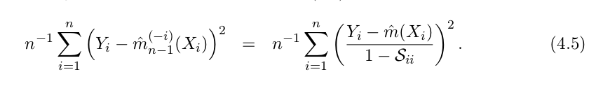
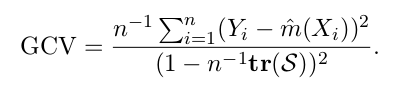

```{r setup, include=FALSE}
knitr::opts_chunk$set(echo = TRUE)
```

Y = m(x) + epsilon

```{r}
diabetes <- read.table("http://stat.ethz.ch/Teaching/Datasets/diabetes2.dat", header = TRUE)
summary(diabetes)
reg <- diabetes[, c("Age", "C.Peptide")]
names(reg) <- c("x", "y")
summary(reg)
reg <- reg[sort.list(reg$x), ] # sort by x
```

write the loo-CV function: 
```{r}
##' Calculates the LOO CV score for given data and regression prediction function
##'
##' @param reg.data: regression data; data.frame with columns 'x', 'y'
##' @param reg.fcn:  regr.prediction function; arguments:
##'                    reg.x: regression x-values
##'                    reg.y: regression y-values
##'                    x:     x-value(s) of evaluation point(s)
##'                  value: prediction at point(s) x
##' @return LOOCV score
loocv <- function(reg.data, reg.fcn){
  ## Help function to calculate leave-one-out regression values
  loo.reg.value <- function(i, reg.data, reg.fcn)
    return(reg.fcn(reg.data$x[-i], reg.data$y[-i], reg.data$x[i]))

  ## Calculate LOO regression values using the help function above
  n <- nrow(reg.data)
  loo.values <- sapply(1:n, loo.reg.value, reg.data, reg.fcn)

  ## Calculate and return MSE
  return( mean( (loo.values-reg.data$y)^2) )
}
```

## a) ksmooth (NW)
Nadaraya-Watson kernel estimator, plot the fit: 
```{r}
plot(reg$x, reg$y)
nw <- ksmooth(reg$x, reg$y, kernel="normal", bandwidth=4)
lines(nw$x, nw$y)
```

### Calculate the cv error
```{r}
reg.fcn.nw <- function(regx, regy, x)
  ksmooth(regx, regy, kernel="normal", bandwidth=4, x.points=x)$y
cv.nw <- loocv(reg, reg.fcn.nw)
cat("the loocv score for NW is:", cv.nw)
```


### Calculate the df using the hat matrix.

**calculate the hat matrix**: 
```{r}
n <- nrow(reg)
Id <- diag(n)
S.nw <- matrix(0, n, n)
for (j in 1:n)
  S.nw[, j] <- reg.fcn.nw(reg$x, Id[,j], reg$x) # why ??? 

df.nw <- sum( diag(S.nw) )
cat("degree of freedom is:", df.nw)
```

Once we get the hat matrix S, we can directly calculate the loocv using the formula 4.5: 
  

In the book there is also an approximation formula (GCV): 



```{r}
yhat.nw <- S.nw %*% reg$y # or use reg.fcn.nw(reg$x, reg$y, reg$x)
cv.nw.hat <- mean(  ( (reg$y-yhat.nw)/ (1-diag(S.nw)) )^2 )
cat("using hat matrix, the loocv score=", cv.nw.hat, ",which is equal to the loocv result")
gcv <- mean( (reg$y-yhat.nw)^2 ) / ( 1 - sum(diag(S.nw))/n )^2
cat("using hat matrix, the GCV=", gcv, ",which is approximately equal to the loocv result")
```

### another way to calculate the hat matrix 
```{r}
library(sfsmisc)
nwfcn <- function(x,y)
hatMat(reg$x, trace=T, pred.sm=reg.fcn.nw, x=reg$x) # the last param `x=reg$x` is the param to the pred.sm ! (currying...)
```


## b) loess (LP)
```{r}
reg.fcn.lp <- function(regx, regy, x)
  predict( loess(regy~regx, enp.target=df.nw, surface="direct"), newdata=x)

cv.lp <- loocv(reg, reg.fcn.lp)
```

using hatMat to get the hat matrix, then use formula to calculate loocv score: 
```{r}
S.lp <- hatMat(reg$x, trace=F, pred.sm=reg.fcn.lp, x=reg$x)
yhat.lp <- S.lp %*% reg$y
cv.lp.hat <- mean(  ( (reg$y-yhat.lp)/ (1-diag(S.lp)) )^2 )
```

## c) smooth.spline (SS)
For `smooth.spline`, the cv score is already in the fit object (var: cv.crit)
```{r}
fit.ss <- smooth.spline(reg$x, reg$y, cv=T, df=df.nw)
cat( fit.ss$cv.crit )
```

we can calculate the cv by our own: 
```{r}
reg.fcn.ss <- function(regx, regy, x)
  predict( smooth.spline(regx, regy, spar=fit.ss$spar), x=x)$y
  # predict( smooth.spline(regx, regy, df=df.nw), x=x)$y
  # predict( fit.ss, x=x)$y

cv.ss <- loocv(reg, reg.fcn.ss)
cat(cv.ss)

S.ss <- hatMat(reg$x, trace=F, pred.sm=reg.fcn.ss, x=reg$x)
yhat.ss <- S.ss %*% reg$y
cv.ss.hat <- mean(  ( (reg$y-yhat.ss)/ (1-diag(S.ss)) )^2 )
cat(cv.ss.hat)
```

The loo cv score by the function `loocv` is slight different from the other 2, this is caused by the spar param. 

## d) smooth.spline using automatic selection of df
```{r}
fit.ss.auto <- smooth.spline(reg$x, reg$y, cv=T)
cv.ss.auto <- fit.ss.auto$cv.crit
cat(cv.ss.auto)
```

## e) constant fit of data (i.e. mean of y values)
```{r}
reg.fcn.const <- function(regx, regy, x) mean(regy)
cv.const <- loocv(reg, reg.fcn.const)
cat(cv.const)
```

## f) conclusion
compare the above results
```{r}
sort(c(nw=cv.nw, lp=cv.lp, ss=cv.ss, ssopt=cv.ss.auto, const=cv.const))
```

==> according to the calculated values, the optimized smooth spline have smallest generalization error. 

**why the smooth spline with auto-df-selection is not fair: **
>The loo CV mimics new unseen data, but this is not true if the method includs a param-choosing by optimizing the CV score. Because the output depends on all CVs, thus the result is no longer indp of the point left out. Thus this CV score is over-optimistic.
>For this reason, we could conclude that the lp method performs best.


