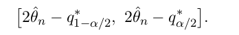

```{r setup, include=FALSE}
knitr::opts_chunk$set(echo = TRUE)
```

`Yi = beta1 + beta2*xi2 + beta3*xi3 + episloni`

```{r}
x2 <- rep(1:5, 5) # data length = 25
x3 <- rep(1:5, each = 5)
```


Auxiliary function that gives the regression coefficients when a given permutation of the data is used, this function takes the (permutated) data (bootstrap sample) and returns the linear fit coefficients. 

```{r}
lmcoefs1 <- function(data, ind) coef(lm(y ~ x2 + x3, data = data[ind, ])) # ind=row index
# 10x faster version: 
lmcoefs <- function(data, ind) {
  d <- as.matrix(data)[ind,,drop=FALSE] 
  coef(lm.fit(cbind(1, d[,c("x2","x3")]), d[,"y"])) # `data` should be a df with cols=[y, x2, x3]
}
```

## a). Bootstrap routine
write a bootstrap function that returns three confidence intervals, one for each regression parameter beta_j. 

First some quick code to try out the MARGIN param in `apply`, it specifies applying on row or column of data:
```{r}
len <- 5
B <- 3
bs <- replicate(B, sample(1:len, len, replace = TRUE)) 
print(bs) # size = len * B
print( apply(bs, MARGIN=c(1), sum) ) # 1: apply on each row
print( apply(bs, MARGIN=c(2), sum) ) # 2: apply on each column
```


first a function that returns for each BS sample the 3 coefs: 
```{r}
obst.est <- function(data, B){# returns the 3 estimated coeffs for each bs sample shape=(3*B)
  len <- nrow(data)
  # Create matrix of indexes of dimension (len x B) where each colum corresponds to a bootstrap sample
  ind <- replicate(B, sample(1:len, len, replace = TRUE)) # shape of ind = len * B
  # Bootstrap estimations of regression coefficients using the B bootstrap samples
  apply(ind, MARGIN=c(2), lmcoefs, data = data) # each col is a bs-sample, apply to each col
  # result shape: 3 * B
}
```

Then a function to get the conf-interval for each of the 3 coefs (coverage=1-alpha).
This is given by eq 5.5 on page 42: 
  
so: 
```{r}
obst.ci <- function(bst.pars, data, alpha){ # returns conf-intervals for each param shape=(3*2)
  ## Estimate regression parameters without using bootstrap
  reg.pars <- lmcoefs(data, 1:nrow(data))
  ## Calculate empirical quantiles of the bootstrap distribution
  # shape of bst.pars=(3*B), each col of bst.pars is (beta1, beta2, beta3), 
  # each row is betai for each bs sample --> apply quantile to each row!
  qt <- apply(bst.pars, MARGIN=c(1), quantile, 
    probs = c(1-alpha/2, alpha/2), names = FALSE) # `probs` and `names` are params for `quantile`
  ## Return vector of bootstrap confidence intervals
  2*reg.pars - t(qt) ## (cf. Formula (5.5) in the lecture notes)
}
```

## b) and c). simulate for 100 datasets
Each time compare with classical conf-interval, and the interval from `boot.ci`. 

```{r}
set.seed(84)
# install.packages("boot")
library(boot)
B <- 1000
alpha <- 0.05
```

To compute theoritical ("classical") conf-interval, use `confint`, example:
```{r}
y <- 1-2*x2+3*x3+rnorm(25)
fit <- lm(y~x2+x3, data=data.frame(y=y, x2=x2, x3=x3))
confint(fit, level=1-alpha)
```
To compute conf-interval by `boot`, use the following code: 
```
bst.sample <- boot(data=dat, statistic=lmcoefs, R=B)
bst.ci <- boot.ci(bst.sample, conf=1-alpha, type="basic", index=k)$basic[c(4,5)] # confint for x_k
```


Now let's run the simulation, each time we generate the dataset, then use bootstrap to get the conf-interval for the betas. To store the conf-intervals (shape=3*2) for everyrun, should use an array of shape (nrep * 3 * 2). 

```{r}
nrep <- 100 # 1000 is too slow...
ci.Bt <- ci.T <- ci.Bs <- array(0, dim=c(nrep, 3, 2) ) # store theory and bs confint
# ci.T[i,j,] = conf-intervals for xj in ith simulation
for(i in 1:nrep){ # simulate 100 times
  # generate data
  y <- 1-2*x2+3*x3+rnorm(25) # rnorm: change to other noise: `rt`, `rexp`
  data = data.frame(y=y, x2=x2, x3=x3) 
  
  # run bootstrap and get conf-interval
  bst.pars <- obst.est(data, B)
  confint.bst <- obst.ci(bst.pars, data, alpha)
  
  # calculate classical(theoritical) conf-interval
  fit <- lm(y~x2+x3, data=data.frame(y=y, x2=x2, x3=x3))
  confint.theory <- confint( fit , level=1-alpha)
  
  # calculate confint by `boot`
  bst.sample <- boot(data=data, statistic=lmcoefs, R=B)
  confint.boot <- matrix(0, nrow=3, ncol=2)
  for(k in 1:3)
    confint.boot[k,] <- boot.ci(bst.sample, conf=1-alpha, type="basic", index=k)$basic[c(4,5)]
  
  # store the values
  ci.Bs[i,,] <- confint.bst
  ci.T[i,,] <- confint.theory
  ci.Bt[i,,] <- confint.boot
}
```

Now we plot the conf-intervals as vertical segments, we can do this by `segments`. To first plot nothing, use type="n" -- no plot. And to dynamically determine the ylim for plot, use the function `extendrange`. Finally, if the true param is not in the interval, use red color, this is achieved using `ifelse`:

```{r}
par(mfrow=c(3,1)) # each plot for one param betai
true.beta <- c(1, -2, 3)
for(k in 1:3) { # plot for the 3 params beta_k
  plot( 1:nrep, type="n", ylab="conf interval",
       ylim=extendrange(ci.T[,k,],f=0.5) ) 
  for(i in 1:nrep){
    lo.Bt <- ci.Bt[i,k,1]
    hi.Bt <- ci.Bt[i,k,2]
    col.Bt <- ifelse(true.beta[k]<hi.Bt && true.beta[k]>lo.Bt, 1, 2)
    segments(x0=i, y0=lo.Bt, y1=hi.Bt, col=col.Bt, lty=2)
    
    lo.T <- ci.T[i,k,1]
    hi.T <- ci.T[i,k,2]
    col.T <- ifelse(true.beta[k]<hi.T && true.beta[k]>lo.T, 1, 2)
    segments(x0=i+0.2, y0=lo.T, y1=hi.T, col=col.T, lty=1)
    
    lo.Bs <- ci.Bs[i,k,1]
    hi.Bs <- ci.Bs[i,k,2]
    col.Bs <- ifelse(true.beta[k]<hi.Bs && true.beta[k]>lo.Bs, 1, 2)
    segments(x0=i+0.4, y0=lo.Bs, y1=hi.Bs, col=col.Bs, lty=3)
  }
}
```

## d).S L1 loss and L1 generalization err (estimated by bootstrap)
```{r}
nrep <- 100
err.Bs <- err.L1 <- numeric(length=nrep)
for(i in 1:nrep){ # simulate 100 times
  # generate data
  y <- 1-2*x2+3*x3+rnorm(25) # rnorm: change to other noise: `rt`, `rexp`
  data = data.frame(y=y, x2=x2, x3=x3) 
  
  # compute classical L1 loss
  fit <- lm(y~x2+x3, data=data.frame(y=y, x2=x2, x3=x3))
  err.L1[i] <- mean( abs(data$y-fitted(fit)) )
  
  # compute bootstrap error = 1/B*sum(L1 loss for each bs sample)
  bst.pars <- obst.est(data, B) # shape=(3*B), each col is the fitted linear model betas
  bst.fitted <- apply( bst.pars, MARGIN=c(2), function(betas) 1*betas[1]+x2*betas[2]+x3*betas[3] ) # can be written as a matrix multiplication, but not easy to understand...
  # 25*B fitted values, each col is a fit for one bs sample
  bst.l1err <- apply( abs(bst.fitted-data$y), MARGIN=2, mean ) # B L1 errors
  err.Bs[i] <- mean(bst.l1err)
}
```

Compute averages over the whole range of simulations:

```{r}
print( mean(err.L1) )
print( mean(err.Bs) )
```

remark:  
>as expected, the bootstrap generalization error is larger than the L1 loss. 


