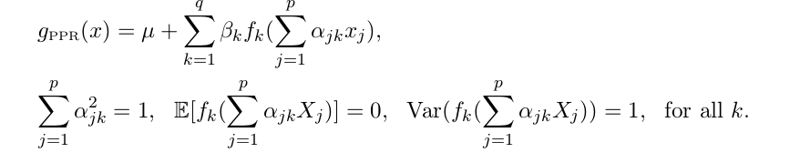

```{r setup, include=FALSE}
knitr::opts_chunk$set(echo = TRUE)
```
PPR: projection pursuit regression
MARS: multivariate adaptive regression splines
```{r}
set.seed(123)
data(ozone, package="gss")
```


## a) preprocessing

Take log of upo3, remove outliers, standardize predictors. 

```{r}
chgNames <- function(dfr, oldNms, newNms) {
  colnames(dfr)[colnames(dfr) %in% oldNms] <- newNms
  dfr
}
d.ozone <- chgNames(ozone,
                    oldNms = c("upo3", "wdsp", "hmdt", "sbtp"),
                    newNms = c("O3","wind", "humidity", "temp"))
d.ozone <- subset(transform(d.ozone, "logO3" = log(O3)), select = -O3)
d.ozone.e <- d.ozone[-which.max(d.ozone[,"wind"]),] # remove outlier
d.ozone.es <- d.ozone.e
d.ozone.es[,-10] <- scale(d.ozone.e[,-10]) # standardize data
```

## b) fit with MARS 

Fit with MARS: 
```{r}
# install.packages("earth")
library(earth)
fit.MARS <- earth(logO3~., data=d.ozone.es, degree=2)
summary(fit.MARS)
```

MARS involves interactions terms, as we can seen from the summary. 

plot the MARS fit using `plotmo`:
```{r}
plotmo(fit.MARS, degree2=F)
title(main="main effects")

plotmo(fit.MARS, degree1=F)
title(main="interactions")
```

## c) fit with PPR
PPR fits q(`nterms`) NP regressors(`"supsmu", "spline", "gcvspline"`), each on a projection direction (alpha_i). 



To plot the fit (4 terms, 4 ridge functions to plot), use `sfsmisc::mult.fig` to setup plot par. 
```{r}
fit.PPR <- ppr(logO3~., data=d.ozone.es, nterms=4)
summary(fit.PPR)
library(sfsmisc)
mult.fig(4)
plot(fit.PPR, type="l")
```

Remark: 
>Fitted lines of ridge funcitons are too wiggly, therefore model is not optimal. A better model could have smoother fitted ridge lines. 

## d) find best PPR param using CV
The given cv function:
```{r}
cv <- function(fitfn, formula = logO3 ~ . , data = d.ozone.es, ..., trace = TRUE){
  modFrame <- model.frame(formula, data = data)
  nc <- nrow(data)
  ssr <- 0
  if(trace) cat(" j = ")
  for(j in 1:nc) {
  if(trace) cat(if(j %% (nc %/% 10) == 1) paste(j, "") else ".")
  ## Fit without 'j' :
  fit <- fitfn(formula=formula, data = data[-j ,], ...)
  ## Evaluate at 'j' :
  ssr <- ssr + (model.response(modFrame)[j] - predict(fit, modFrame[j,]))^2
  }
  if(trace) cat("\n")
  ssr
}
```

Search for best param, the grid is: nterms=3:5, sm.method=c("supsmu", "spline", "gcvspline"), df=5:7(only for spline), max.terms = nterms+3: 

We use a list of vectors/matrix to store the cv results, and for better printing, we use `names` and `dimnames` to specify a name for each cv score. To concat a prefix to a vector, use `paste`. 

```{r}
nterms.grid <- 3:5
df.grid <- 5:7
# store cv scores for the 3 sm.method into a list
cv.scores <- list( supsmu=numeric(3), gcvspline=numeric(3), 
               spline=matrix(0, nrow=3, ncol=3) ) # for splines there are 2 params, so use a matrix

# add names to the vectors/matrix 
names(cv.scores$gcvspline) <- names(cv.scores$supsmu) <- paste("nterms=", nterms.grid, sep="")
dimnames(cv.scores$spline) <- list(paste('nterms=', nterms.grid, sep=""), paste("df=", df.grid, sep=""))

for(i in seq_along(nterms.grid)){ # very slow... 
  cat("i=", i, "...")
  nt <- nterms.grid[i]
  cv.scores$supsmu[i] <- cv(ppr, sm.method="supsmu",nterms=nt, max.terms=nt+3, trace=F)
  cv.scores$gcvspline[i] <- cv(ppr, sm.method="gcvspline", nterms=nt, max.terms=nt+3, trace=F)
  for(j in seq_along(df.grid))
    cv.scores$spline[i,j] <- cv(ppr, sm.method="spline", nterms=nt, max.terms=nt+3, df=df.grid[j], trace=F)
  cat("...done. \n")
}
```

## e) fit MARS seraching for best degree of interaction
```{r}
deg.grid=1:3
cv.scores <- c(cv.scores, mars=list(numeric(3))) # append another vector
names(cv.scores$mars) <- paste("degree=", deg.grid, sep="")
for(i in seq_along(deg.grid))
  cv.scores$mars[i] <- cv(earth, degree=deg.grid[i], trace=F)
```

The gam model: gam fits a NP regressor for each predictor xj and add them up. 

and it use different df for different xj, as shown in `edf` column of the summary. 

```{r}
library(mgcv)
fit.gam <- gam( wrapFormula(logO3~., data = d.ozone.es), data=d.ozone.es) # for gam, have to first wrapFormula instead of passing directly logO3~. 
summary(fit.gam)
par(mfrow=c(3,3))
plot(fit.gam, shade=T)
```


```{r}
wrapGam <- function(formula, data,...){
  gamForm <- wrapFormula(formula, data = data)
  gam(gamForm, data=data, ...)
}
gam.cv <- cv(wrapGam, formula=logO3~., trace=T) 
cv.scores <- c(cv.scores, gam=gam.cv) # append a number
```

compare the models: 
```{r}
print(cv.scores)
```

Remarks: 
>The PPR with spline(df=6 nterms=4) performs best. The gam model performs also quite good. 

## f) plot best PPR model
```{r}
fit.PPRbest <- ppr(logO3~., data=d.ozone.es,
                   sm.method="spline", nterms=4, max.terms=7, df=6)
mult.fig(4)
plot(fit.PPRbest, type="l")
```

==> the best cv-selected model looks smoother. 


## g) interpret the alpha matrix
The PPR model (P70 in notes) is: 


```{r}
round( fit.PPRbest$beta, digits = 3)
round( fit.PPRbest$alpha, digits = 3)
```

>The coefficient of the variable `ibht` has relatively small absolute values in all of the terms => it seems to be not so important. 
>`term 3` is dominated mainly by the value of `day`, whereas the other three terms each involve at least 4 variables and are less interpretable...

